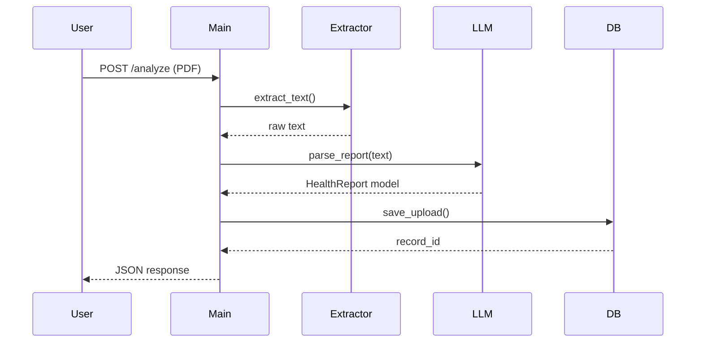

# Backend Design

> **Warning:** This content is AI inspired.

The design focuses on modularity. We use:
- `pdf_extractor`: uses pdfplumber for extracting text.
- `llm_parser`: uses google-genai to parse text into structured JSON.
- `database`: uses sqlite3 to store upload records.
- `models`: Pydantic models for structured output schema.

## Component Interaction

