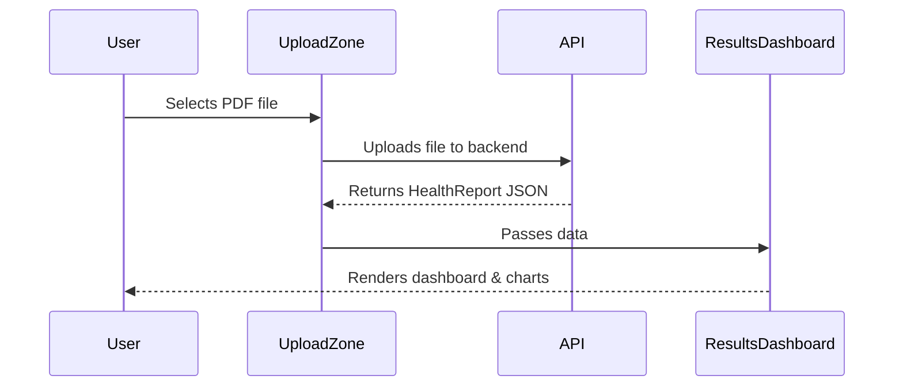

# Frontend Design

> **Warning:** This content is AI inspired.

- **UploadZone**: Provides a drag-and-drop or file selection area for PDFs.
- **ResultsDashboard**: Displays the patient summary and suggested fixes.
- **MarkerChart**: Uses a charting library to visualize biomarker levels (Low, Normal, High).

## Component Flow

